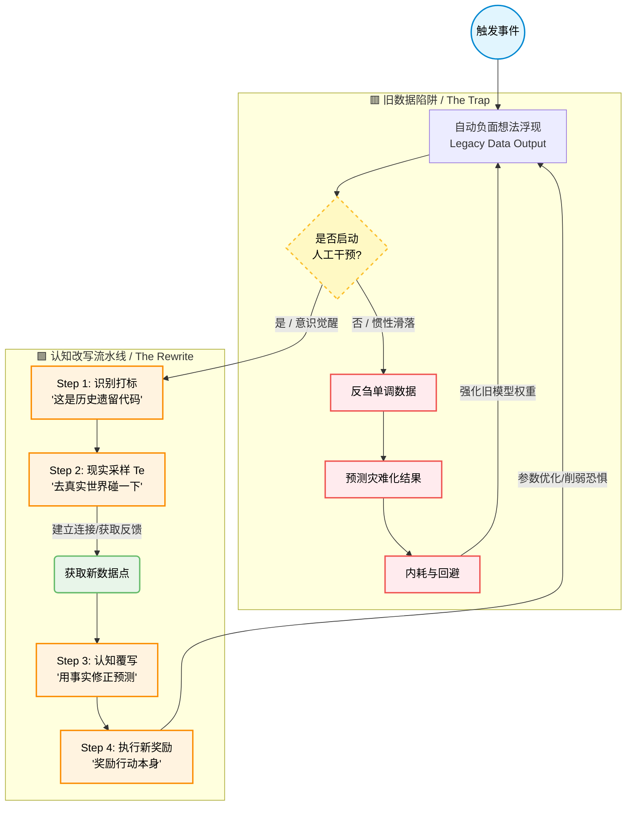
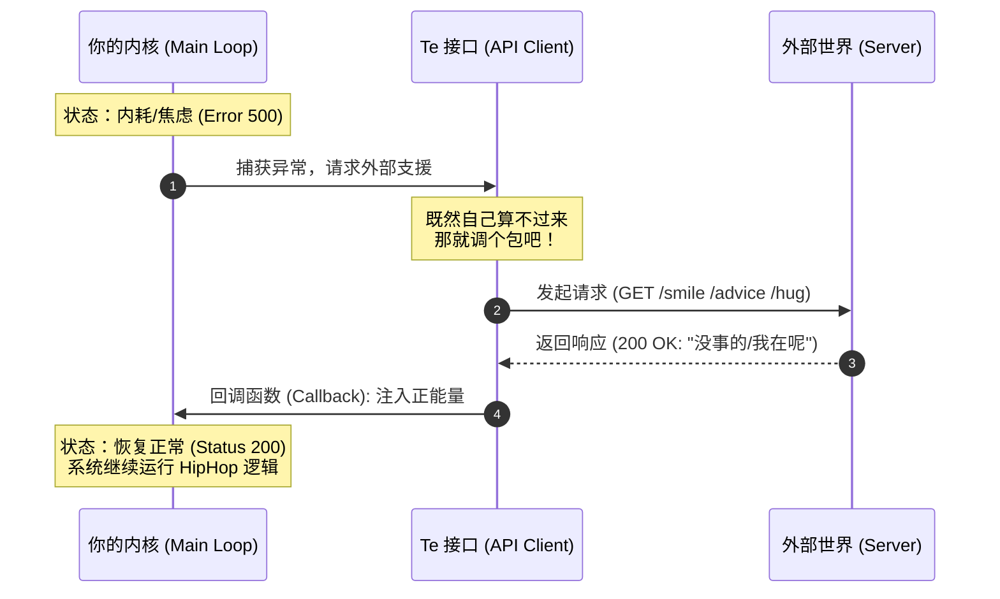

# 认知改写走出内耗模型 (Cognitive Rewriting Model)

```mermaid
graph TD
    %% --- 样式定义区 ---
    classDef trigger fill:#e1f5fe,stroke:#0288d1,stroke-width:2px,color:#000
    classDef oldData fill:#ffebee,stroke:#ef5350,stroke-width:2px,color:#000
    classDef newData fill:#e8f5e9,stroke:#66bb6a,stroke-width:2px,color:#000
    classDef action fill:#fff3e0,stroke:#fb8c00,stroke-width:2px,color:#000
    classDef decision fill:#fff9c4,stroke:#fbc02d,stroke-width:2px,stroke-dasharray: 5 5,color:#000

    %% --- 流程开始 ---
    Start((触发事件)):::trigger --> AutoThought[自动负面想法浮现<br/>Legacy Data Output]
    
    %% --- 关键决策点 ---
    AutoThought --> Decision{是否启动<br/>人工干预?}
    class Decision decision

    %% --- 分支 1: 旧数据陷阱 ---
    subgraph Trap [🟥 旧数据陷阱 / The Trap]
        direction TB
        Decision -- 否 / 惯性滑落 --> Ruminate[反刍单调数据]
        Ruminate --> Catastrophe[预测灾难化结果]
        Catastrophe --> Avoid[内耗与回避]
        Avoid -- 强化旧模型权重 --> AutoThought
    end
    class Ruminate,Catastrophe,Avoid oldData

    %% --- 分支 2: 认知改写流水线 ---
    subgraph Pipeline [🟩 认知改写流水线 / The Rewrite]
        direction TB
        Decision -- 是 / 意识觉醒 --> Step1[Step 1: 识别打标<br/>'这是历史遗留代码']
        
        Step1 --> Step2[Step 2: 现实采样 Te<br/>'去真实世界碰一下']
        
        Step2 -- 建立连接/获取反馈 --> NewData(获取新数据点)
        
        NewData --> Update[Step 3: 认知覆写<br/>'用事实修正预测']
        
        Update --> Reward[Step 4: 执行新奖励<br/>'奖励行动本身']
    end
    class Step1,Step2,Update,Reward action
    class NewData newData

    %% --- 闭环效应 ---
    Reward -- 参数优化/削弱恐惧 --> AutoThought
```

```mermaid
sequenceDiagram
    autonumber
    participant INFP as 你的内核 (Main Loop)
    participant Te as Te 接口 (API Client)
    participant World as 外部世界 (Server)

    Note over INFP: 状态：内耗/焦虑 (Error 500)
    
    INFP->>Te: 捕获异常，请求外部支援
    
    Note over Te: 既然自己算不过来<br/>那就调个包吧！
    
    Te->>World: 发起请求 (GET /smile /advice /hug)
    
    World-->>Te: 返回响应 (200 OK: "没事的/我在呢")
    
    Te->>INFP: 回调函数 (Callback): 注入正能量
    
    Note over INFP: 状态：恢复正常 (Status 200)<br/>系统继续运行 HipHop 逻辑
```
